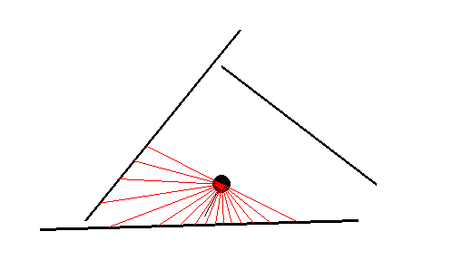

# 2DLiDarSim

## Requirement

### Ubuntu22

```bash
pip install numpy matplotlib pygame
```

### WSL2

```bash
pip install numpy matplotlib
sudo apt install python3-pygame
```

# Test

```bash
python3 test/sim_test.py
```



- A robot(black circle) and Lazers(Red lines) will be shown.

# Usage

- see also example

## Position

- np.ndarray with 3 elements (x, y, th) represents "pos" in Simulator

## Setting of walls

- A wall consists of two 2-dim pos (start_pos and end_pos)
- walls are representsed by list of walls

```py
init_pos = ( ... )
wall_arr = [
    [np.array([10, 10]), np.array([30,30])],
    #...
    ]

sim = simulator.Simulator(wall_arr, init_pos)
```

- You can also register walls by using `Walls` class

```py
import simulator
#...
walls = simulator.Walls()
walls.append([10, 10], [30,30]) # register walls with start-end pos
#... get wall_arr from
wall_arr = walls.get()

sim = simulator.Simulator(wall_arr, init_pos)
```

## Executing simulator

### 1. simple simulator

- simple simulator (`Simulator` class) changes robot_pos directly

```py
import simulator
import pygame

# ... registering of walls and init_pos
sim = simulator.Simulator(...)

dx, dy, dth = 0, 0, 0.01
while True:
    for event in pygame.event.get():
        if event.type == pygame.QUIT:
            pygame.quit()
            sys.exit()
    sim.move(dx, dy, dth) #new_pos = pos + (dx, dy, dth)
    sim.draw()
```

### 2. accel simulator

- accel simulator (`accelSimulator` class) needs accel input and demonstrates machine's postion.

```py
import simulator
import pygame

# ... registering of walls and init_pos
sim = simulator.accelSimulator(...)

ax, ay, ath = 0, 0, 0.01 # accel
dt = 0.01 # delta time
q_noise = [0, 0, 0, 0, 0, 0] # pos, vel noise
while True:
    for event in pygame.event.get():
        if event.type == pygame.QUIT:
            pygame.quit()
            sys.exit()
    #new_pos = pos + vel*dt + 0.5*acc*dt**2 + pos_noise
    #new_vel = vel + acc*dt + acc_noise
    sim.accel(ax, ay, ath, dt, q_noise)
    sim.draw()
```
